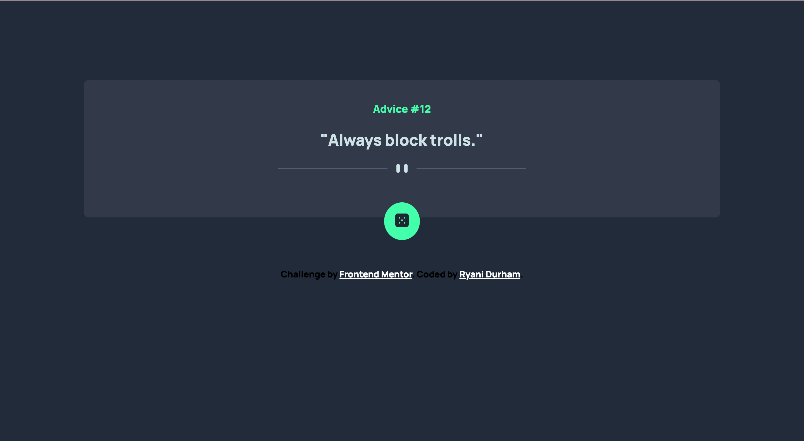

# Frontend Mentor - Advice generator app solution

This is a solution to the [Advice generator app challenge on Frontend Mentor](https://www.frontendmentor.io/challenges/advice-generator-app-QdUG-13db). Frontend Mentor challenges help you improve your coding skills by building realistic projects.

## Table of contents

- [Overview](#overview)
  - [The challenge](#the-challenge)
  - [Screenshot](#screenshot)
  - [Links](#links)
- [My process](#my-process)
  - [Built with](#built-with)
  - [What I learned](#what-i-learned)
  - [Useful resources](#useful-resources)
- [Author](#author)

## Overview

### The challenge

Users should be able to:

- Click the button and get a new piece of advice with every click

### Screenshot



### Links

- Solution URL: [Ryani's GitHub](https://github.com/ryanimdurham/Advice-Generator)
- Live Site URL: [Advice Generator](https://ryanimdurham.github.io/Advice-Generator/)

## My process

1. Knowing that I was working with an API, I first worked on a fetch request to make sure I could see the data object in the console.
2. Once my promise returned the data from the API, I worked on adding that data to the screen.
3. Continued to add functionality by adding a button that refreshed the page and returned a new piece of advice with each click.
4. Styled with CSS

### Built with

- Semantic HTML5 markup
- CSS custom properties
- Flexbox
- Mobile-responsiveness

### What I learned

I learned that the then() method works like a function and that really helped me with returing data from my fetch request.

```js
.then((data) => {
    document.getElementById('advice-id').innerHTML = data.slip.id;
    document.getElementById('advice-text').innerHTML = data.slip.advice;
    console.log(data)}
```

### Useful resources

- [Fetch API Docs](https://developer.mozilla.org/en-US/docs/Web/API/Fetch_API/Using_Fetch) - This helped me to write a simple fetch request. I really liked this pattern and will use it going forward.

## Author

- LinkedIn - [Ryani Durham](https://www.linkedin.com/in/ryanidurham/)
- Frontend Mentor - [@Ryanimd](https://www.frontendmentor.io/profile/ryanimd)

